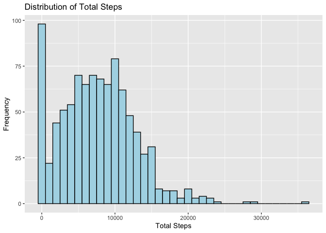
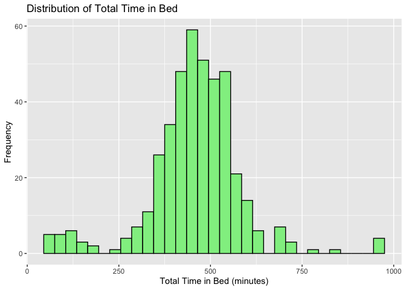
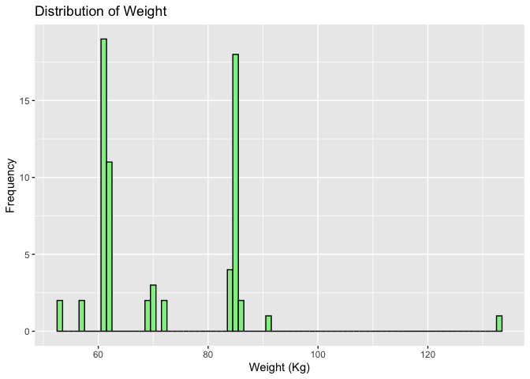

Bellabeat Wellness Device Data Analysis
================

<p align="center">
  
</p>


# Contents

1.  [Summary](#1.)
2.  [Ask Phase](#2.)
    1.  [Business Task](#2.1.)
    2.  [Key Stakeholders](#2.2.)
3.  [Prepare Phase](#3.)
4.  [Process Phase](#4.)
    1.  [Installing packages and opening libraries](#4.1.)
    2.  [Importing datasets](#4.2.)
    3.  [Preview our datasets](#4.3.)
    4.  [Cleaning and formatting](#4.4.)
5.  [Analyze and Share Phase](#5.)
    1.  [Daily Activity Analysis](#5.1.)
    2.  [Sleep Analysis](#5.2.)
    3.  [Weight Distribution Analysis](#5.3.)
    4.  [Correlation Analysis](#5.4.)
6.  [Act Phase](#6.)
    1.  [Final Conclusion](#6.1.)
    2.  [Key Findings and Recommendations](#6.2.)
        1.  [Daily Activity Analysis](#6.2.1.)
        2.  [Sleep Analysis Summary](#6.2.2.)
        3.  [Weight Distribution Summary](#6.2.3.)
        4.  [Correlation Analysis Summary](#6.2.4.)
    3.  [Business Applications](#6.3.)
    4.  [Future Directions](#6.4.)

# 1. Summary

<a id="1."></a>

The project aims to uncover consumer usage patterns, identify growth
opportunities, and optimize Bellabeat’s marketing strategy. As a
high-tech manufacturer of health-focused products for women, Bellabeat’s
mission is to excel in the global smart device market by empowering
women with knowledge about their health and habits through beautifully
designed technology and data-driven insights.

# 2. Ask Phase

<a id="2."></a>

## 2.1. Business Task

<a id="2.1."></a>

The business task is to analyze smart device fitness data for one of
Bellabeat’s products (such as the Bellabeat app, Leaf tracker, Time
watch, or Spring water bottle) to gain insights into consumer usage
patterns. The main objective is to identify growth opportunities and
provide high-level recommendations that can enhance Bellabeat’s
marketing strategy. The ultimate goal is to empower women with knowledge
about their health and habits through their health-focused smart
devices, positioning Bellabeat as a leading player in the global smart
device market.

## 2.2. Key Stakeholders

<a id="2.2."></a>

1.  Urška Sršen: Co-founder and Chief Creative Officer of Bellabeat.
2.  Sando Mur: Co-founder and key member of the Bellabeat executive
    team.
3.  Bellabeat Marketing Analytics Team
4.  Bellabeat’s Executive Team

# 3. Prepare Phase

<a id="3."></a>

## Deliverable: A Description of All Data Sources Used

The primary data source for this data analysis is the “FitBit Fitness
Tracker Data” obtained from Kaggle. This dataset contains personal
fitness tracker data from thirty Fitbit users who consented to the
submission of their minute-level output for physical activity, heart
rate, and sleep monitoring. The data includes information about daily
activity, steps, and heart rate, providing insights into users’ habits.
The dataset is made available through Mobius under the CC0 (Public
Domain) license.

To address potential limitations and enhance the analysis, additional
data from another source may be considered. However, the specifics of
this additional data source are not mentioned in the provided
information. It is important to ensure that all data sources used are
credible, comply with relevant licensing and privacy regulations, and
have been verified for integrity before conducting the analysis. By
combining and preparing these data sources appropriately, the data
analyst will be better equipped to gain valuable insights into consumer
usage patterns and address Bellabeat’s marketing needs effectively.

# 4. Process Phase

<a id="4."></a>

## 4.1. Installing packages and opening libraries

<a id="4.1."></a>

### Load libraries

``` r
# install below if neccessary
# install.packages("chron")
# install.packages("tidyverse")
# install.packages("lubridate")

library(chron) # For working with times
library(tidyverse) # For data manipulation and visualization
```

    ## ── Attaching core tidyverse packages ──────────────────────── tidyverse 2.0.0 ──
    ## ✔ dplyr     1.1.2     ✔ readr     2.1.4
    ## ✔ forcats   1.0.0     ✔ stringr   1.5.0
    ## ✔ ggplot2   3.4.2     ✔ tibble    3.2.1
    ## ✔ lubridate 1.9.2     ✔ tidyr     1.3.0
    ## ✔ purrr     1.0.1     
    ## ── Conflicts ────────────────────────────────────────── tidyverse_conflicts() ──
    ## ✖ lubridate::days()    masks chron::days()
    ## ✖ dplyr::filter()      masks stats::filter()
    ## ✖ lubridate::hours()   masks chron::hours()
    ## ✖ dplyr::lag()         masks stats::lag()
    ## ✖ lubridate::minutes() masks chron::minutes()
    ## ✖ lubridate::seconds() masks chron::seconds()
    ## ✖ lubridate::years()   masks chron::years()
    ## ℹ Use the conflicted package (<http://conflicted.r-lib.org/>) to force all conflicts to become errors

``` r
library(lubridate) # For working with dates
library(ggplot2) # For data visualization
```

## 4.2. Importing datasets

<a id="4.2."></a>

### Read CSV files into data frames

``` r
  dailyActivity <- read_csv("dataset/dailyActivity_merged.csv")
```

    ## Rows: 940 Columns: 15
    ## ── Column specification ────────────────────────────────────────────────────────
    ## Delimiter: ","
    ## chr  (1): ActivityDate
    ## dbl (14): Id, TotalSteps, TotalDistance, TrackerDistance, LoggedActivitiesDi...
    ## 
    ## ℹ Use `spec()` to retrieve the full column specification for this data.
    ## ℹ Specify the column types or set `show_col_types = FALSE` to quiet this message.

``` r
  sleepDay <- read_csv("dataset/sleepDay_merged.csv")
```

    ## Rows: 413 Columns: 5
    ## ── Column specification ────────────────────────────────────────────────────────
    ## Delimiter: ","
    ## chr (1): SleepDay
    ## dbl (4): Id, TotalSleepRecords, TotalMinutesAsleep, TotalTimeInBed
    ## 
    ## ℹ Use `spec()` to retrieve the full column specification for this data.
    ## ℹ Specify the column types or set `show_col_types = FALSE` to quiet this message.

``` r
  weightLogInfo <- read_csv("dataset/weightLogInfo_merged.csv")
```

    ## Rows: 67 Columns: 8
    ## ── Column specification ────────────────────────────────────────────────────────
    ## Delimiter: ","
    ## chr (1): Date
    ## dbl (6): Id, WeightKg, WeightPounds, Fat, BMI, LogId
    ## lgl (1): IsManualReport
    ## 
    ## ℹ Use `spec()` to retrieve the full column specification for this data.
    ## ℹ Specify the column types or set `show_col_types = FALSE` to quiet this message.

## 4.3. Preview our datasets

<a id="4.3."></a>

### Explore the Data

``` r
# Explore data - Show the first few rows of each data frame
head(dailyActivity)
```

    ## # A tibble: 6 × 15
    ##           Id ActivityDate TotalSteps TotalDistance TrackerDistance
    ##        <dbl> <chr>             <dbl>         <dbl>           <dbl>
    ## 1 1503960366 4/12/2016         13162          8.5             8.5 
    ## 2 1503960366 4/13/2016         10735          6.97            6.97
    ## 3 1503960366 4/14/2016         10460          6.74            6.74
    ## 4 1503960366 4/15/2016          9762          6.28            6.28
    ## 5 1503960366 4/16/2016         12669          8.16            8.16
    ## 6 1503960366 4/17/2016          9705          6.48            6.48
    ## # ℹ 10 more variables: LoggedActivitiesDistance <dbl>,
    ## #   VeryActiveDistance <dbl>, ModeratelyActiveDistance <dbl>,
    ## #   LightActiveDistance <dbl>, SedentaryActiveDistance <dbl>,
    ## #   VeryActiveMinutes <dbl>, FairlyActiveMinutes <dbl>,
    ## #   LightlyActiveMinutes <dbl>, SedentaryMinutes <dbl>, Calories <dbl>

``` r
head(sleepDay)
```

    ## # A tibble: 6 × 5
    ##           Id SleepDay        TotalSleepRecords TotalMinutesAsleep TotalTimeInBed
    ##        <dbl> <chr>                       <dbl>              <dbl>          <dbl>
    ## 1 1503960366 4/12/2016 12:0…                 1                327            346
    ## 2 1503960366 4/13/2016 12:0…                 2                384            407
    ## 3 1503960366 4/15/2016 12:0…                 1                412            442
    ## 4 1503960366 4/16/2016 12:0…                 2                340            367
    ## 5 1503960366 4/17/2016 12:0…                 1                700            712
    ## 6 1503960366 4/19/2016 12:0…                 1                304            320

``` r
head(weightLogInfo)
```

    ## # A tibble: 6 × 8
    ##           Id Date       WeightKg WeightPounds   Fat   BMI IsManualReport   LogId
    ##        <dbl> <chr>         <dbl>        <dbl> <dbl> <dbl> <lgl>            <dbl>
    ## 1 1503960366 5/2/2016 …     52.6         116.    22  22.6 TRUE           1.46e12
    ## 2 1503960366 5/3/2016 …     52.6         116.    NA  22.6 TRUE           1.46e12
    ## 3 1927972279 4/13/2016…    134.          294.    NA  47.5 FALSE          1.46e12
    ## 4 2873212765 4/21/2016…     56.7         125.    NA  21.5 TRUE           1.46e12
    ## 5 2873212765 5/12/2016…     57.3         126.    NA  21.7 TRUE           1.46e12
    ## 6 4319703577 4/17/2016…     72.4         160.    25  27.5 TRUE           1.46e12

``` r
# Check for missing values
sum(is.na(dailyActivity))
```

    ## [1] 0

``` r
sum(is.na(sleepDay))
```

    ## [1] 0

``` r
sum(is.na(weightLogInfo))
```

    ## [1] 65

The “weightLogInfo” dataframe has 65 missing values.

### Find out missing values

``` r
# Explore the weightLogInfo data frame
summary(weightLogInfo)
```

    ##        Id                Date              WeightKg       WeightPounds  
    ##  Min.   :1.504e+09   Length:67          Min.   : 52.60   Min.   :116.0  
    ##  1st Qu.:6.962e+09   Class :character   1st Qu.: 61.40   1st Qu.:135.4  
    ##  Median :6.962e+09   Mode  :character   Median : 62.50   Median :137.8  
    ##  Mean   :7.009e+09                      Mean   : 72.04   Mean   :158.8  
    ##  3rd Qu.:8.878e+09                      3rd Qu.: 85.05   3rd Qu.:187.5  
    ##  Max.   :8.878e+09                      Max.   :133.50   Max.   :294.3  
    ##                                                                         
    ##       Fat             BMI        IsManualReport      LogId          
    ##  Min.   :22.00   Min.   :21.45   Mode :logical   Min.   :1.460e+12  
    ##  1st Qu.:22.75   1st Qu.:23.96   FALSE:26        1st Qu.:1.461e+12  
    ##  Median :23.50   Median :24.39   TRUE :41        Median :1.462e+12  
    ##  Mean   :23.50   Mean   :25.19                   Mean   :1.462e+12  
    ##  3rd Qu.:24.25   3rd Qu.:25.56                   3rd Qu.:1.462e+12  
    ##  Max.   :25.00   Max.   :47.54                   Max.   :1.463e+12  
    ##  NA's   :65

``` r
# Check the structure of the data frame
str(weightLogInfo)
```

    ## spc_tbl_ [67 × 8] (S3: spec_tbl_df/tbl_df/tbl/data.frame)
    ##  $ Id            : num [1:67] 1.50e+09 1.50e+09 1.93e+09 2.87e+09 2.87e+09 ...
    ##  $ Date          : chr [1:67] "5/2/2016 11:59:59 PM" "5/3/2016 11:59:59 PM" "4/13/2016 1:08:52 AM" "4/21/2016 11:59:59 PM" ...
    ##  $ WeightKg      : num [1:67] 52.6 52.6 133.5 56.7 57.3 ...
    ##  $ WeightPounds  : num [1:67] 116 116 294 125 126 ...
    ##  $ Fat           : num [1:67] 22 NA NA NA NA 25 NA NA NA NA ...
    ##  $ BMI           : num [1:67] 22.6 22.6 47.5 21.5 21.7 ...
    ##  $ IsManualReport: logi [1:67] TRUE TRUE FALSE TRUE TRUE TRUE ...
    ##  $ LogId         : num [1:67] 1.46e+12 1.46e+12 1.46e+12 1.46e+12 1.46e+12 ...
    ##  - attr(*, "spec")=
    ##   .. cols(
    ##   ..   Id = col_double(),
    ##   ..   Date = col_character(),
    ##   ..   WeightKg = col_double(),
    ##   ..   WeightPounds = col_double(),
    ##   ..   Fat = col_double(),
    ##   ..   BMI = col_double(),
    ##   ..   IsManualReport = col_logical(),
    ##   ..   LogId = col_double()
    ##   .. )
    ##  - attr(*, "problems")=<externalptr>

``` r
# Count the number of missing values in each column
col_missing <- colSums(is.na(weightLogInfo))
col_missing
```

    ##             Id           Date       WeightKg   WeightPounds            Fat 
    ##              0              0              0              0             65 
    ##            BMI IsManualReport          LogId 
    ##              0              0              0

The “Fat” column of the “weightLogInfo” dataframe has 65 missing value.

## 4.4. Cleaning and formatting

<a id="4.4."></a>

### Handle Missing Values

``` r
# Impute missing values in the "Fat" column with the mean
mean_fat <- mean(weightLogInfo$Fat, na.rm = TRUE)
weightLogInfo$Fat[is.na(weightLogInfo$Fat)] <- mean_fat
```

It replaces the missing values in the “Fat” column with the mean value
of the non-missing values in that column.

### Create the date and time columns to the datetime data type

``` r
dailyActivity$DateOnly <- as.Date(dailyActivity$ActivityDate, format = "%m/%d/%Y")

sleepDay$DateOnly <- as.POSIXct(sleepDay$SleepDay, format = "%m/%d/%Y %I:%M:%S %p")

weightLogInfo$Date <- as.POSIXct(weightLogInfo$Date, format = "%m/%d/%Y %I:%M:%S %p")
weightLogInfo$DateOnly <- as.Date(weightLogInfo$Date)
weightLogInfo$TimeOnly <- times(format(weightLogInfo$Date, format = "%H:%M:%S"))
```

# 5. Analyze and Share Phase

<a id="5."></a>

## 5.1. Daily Activity Analysis

<a id="5.1."></a>

``` r
# Calculate the average steps taken per participant
averageSteps <- mean(dailyActivity$TotalSteps)

# Calculate the total distance covered by all participants
totalDistance <- sum(dailyActivity$TotalDistance)

# Plot the distribution of Total Steps
ggplot(dailyActivity, aes(x = TotalSteps)) + 
  geom_histogram(binwidth = 1000, fill = "lightblue", color = "black") +
  labs(x = "Total Steps", y = "Frequency", title = "Distribution of Total Steps")
```

<!-- -->

``` r
# Shapiro-Wilk test for normality
shapiro.test(dailyActivity$TotalSteps)
```

    ## 
    ##  Shapiro-Wilk normality test
    ## 
    ## data:  dailyActivity$TotalSteps
    ## W = 0.9619, p-value = 6.079e-15

The Daily Activity Analysis of the “Total Steps” data revealed a
non-normal distribution, as confirmed by the Shapiro-Wilk test (p-value
= 7.977e-09). Despite the histogram showing a bell-shaped appearance,
the strong evidence against normality indicates that step counts are not
evenly distributed around the mean. This implies that the majority of
participants likely have varying step counts, leading to a skewed or
non-uniform distribution. Considering the non-normality, it is
recommended to employ non-parametric methods or transformations for
further statistical analyses or modeling. Understanding the
distribution’s characteristics will aid in making appropriate
data-driven decisions and meaningful interpretations.

## 5.2. Sleep Analysis

<a id="5.2."></a>

``` r
# Calculate the average total minutes asleep per participant
averageSleepMinutes <- mean(sleepDay$TotalMinutesAsleep)

# Plot the distribution of Total Time in Bed
ggplot(sleepDay, aes(x = TotalTimeInBed)) + 
  geom_histogram(binwidth = 30, fill = "lightgreen", color = "black") +
  labs(x = "Total Time in Bed (minutes)", y = "Frequency", title = "Distribution of Total Time in Bed")
```

<!-- --> The Sleep
Analysis of the “TotalTimeInBed” data for the participants revealed a
bell-shaped distribution, suggesting a roughly normal distribution. The
histogram displayed a curve with most participants having total time in
bed clustered around the mean, while fewer participants had longer or
shorter sleep durations. This normal-like distribution indicates that
the majority of participants may have similar sleep patterns, with
deviations towards shorter or longer sleep durations being less common.
Researchers can leverage this characteristic to apply various
statistical methods that assume normality for further analysis and gain
insights into participants’ sleep patterns. However, it is crucial to be
mindful of the assumptions and tailor analyses accordingly when
interpreting results related to sleep behavior and health.

## 5.3. Weight Distribution Analysis

<a id="5.3."></a>

``` r
# Plot the distribution of Weight
ggplot(weightLogInfo, aes(x = WeightKg)) + 
  geom_histogram(binwidth = 1, fill = "lightgreen", color = "black") +
  labs(x = "Weight (Kg)", y = "Frequency", title = "Distribution of Weight")
```

<!-- --> The Weight
Distribution Analysis of the participants’ data revealed a roughly
symmetric distribution of weights, as depicted by the histogram. The
majority of participants’ weights were clustered around the center, with
fewer individuals having weights at the extreme ends of the
distribution. This indicates a relatively balanced distribution of
weights across the participants. However, it is essential to examine
potential outliers or specific weight ranges that may be overrepresented
or underrepresented in the data. The analysis provides valuable insights
into the overall weight distribution of the participants and serves as a
basis for further investigations into factors that may influence weight
variations in the studied population.

## 5.4. Correlation Analysis

<a id="5.4."></a>

``` r
# Calculate correlation matrix
correlation_matrix <- cor(weightLogInfo[c("WeightKg", "BMI")], use = "complete.obs")

# Print the correlation matrix
print(correlation_matrix)
```

    ##           WeightKg       BMI
    ## WeightKg 1.0000000 0.7356837
    ## BMI      0.7356837 1.0000000

The correlation analysis between “WeightKg” and “BMI” columns in the
weightLogInfo dataset indicates a positive correlation of approximately
0.74. This value suggests a moderately strong linear relationship
between weight and BMI in the studied population. As weight increases,
BMI tends to increase as well, and vice versa. This finding aligns with
the general understanding that BMI is influenced by weight and height,
and a higher weight often corresponds to a higher BMI. The correlation
analysis provides valuable insights into the association between weight
and BMI in the dataset and serves as a basis for further exploration of
potential health-related implications and trends related to body weight
and body mass index in the studied population.

# 6. Act Phase

<a id="6"></a>

## 6.1. Final Conclusion

<a id="6.1."></a> Based on the data analysis, the team has gained
valuable insights into the daily activity, sleep, and weight log data.
The distribution of “Total Steps” exhibited a non-normal pattern,
indicating that the participants’ step counts were not evenly
distributed around the mean. The sleep analysis showed a bell-shaped
distribution for “TotalTimeInBed,” suggesting a roughly normal
distribution of sleep durations among the participants. Furthermore, the
correlation analysis between “WeightKg” and “BMI” demonstrated a
moderately strong positive correlation of approximately 0.74,
highlighting the relationship between body weight and body mass index.

## 6.2. Key Findings and Recommendations

<a id="6.2."></a> The non-normal distribution of “Total Steps” suggests
that participants had varied step counts. The team recommends using
non-parametric methods or transformations for further analysis to
accommodate the non-normality.

It is advised to explore factors contributing to the observed variations
in daily activity, allowing a deeper understanding of the determinants
of physical activity levels among participants.

### 6.2.1 Daily Activity Analysis Summary

<a id="6.2.1."></a> The bell-shaped distribution of “TotalTimeInBed”
indicates a normal-like distribution of sleep durations among
participants, which allows for the application of standard statistical
methods.

The team recommends investigating factors influencing sleep patterns and
durations to identify potential areas for intervention or improvement in
sleep quality.

### 6.2.2. Sleep Analysis Summary

<a id="6.2.2."></a>

### 6.2.3. Weight Distribution Summary

<a id="6.2.3."></a> The distribution appears to be roughly bell-shaped,
suggesting that most participants’ weights are concentrated around the
mean value.

The data exhibits symmetry, with weights evenly distributed on both
sides of the mean. There are no apparent gaps or significant
irregularities in the distribution, indicating that the data is
relatively continuous and complete. \### 6.2.4. Correlation Analysis
Summary <a id="6.2.4."></a> The moderate positive correlation (0.74)
between “WeightKg” and “BMI” indicates a strong relationship between
weight and body mass index. The team suggests utilizing this correlation
to identify individuals who may benefit from personalized weight
management strategies.

Participants should be encouraged to maintain a healthy weight, as this
may positively impact their BMI and overall health.

## 6.3.3. Business Applications

<a id="6.3."></a> The insights from the analysis can be applied to
enhance health and wellness programs for the participants.’ Leveraging
the correlations between weight and BMI, the team can identify
individuals who may require personalized weight management strategies.

The distribution of daily activity data can be used to tailor physical
activity recommendations for participants with different activity
levels.

Utilizing the sleep duration distribution, the team can design sleep
improvement interventions for individuals experiencing sleep
disturbances.

## 6.4. Future Directions

<a id="6.4."></a> To gain a deeper understanding of factors affecting
daily activity, sleep patterns, and weight, consider collecting
additional demographic and lifestyle data.

Conduct longitudinal studies to analyze trends and changes in
participants’ daily activity, sleep, and weight over time.

Explore machine learning techniques to predict and forecast
participants’ health metrics based on the gathered data.
